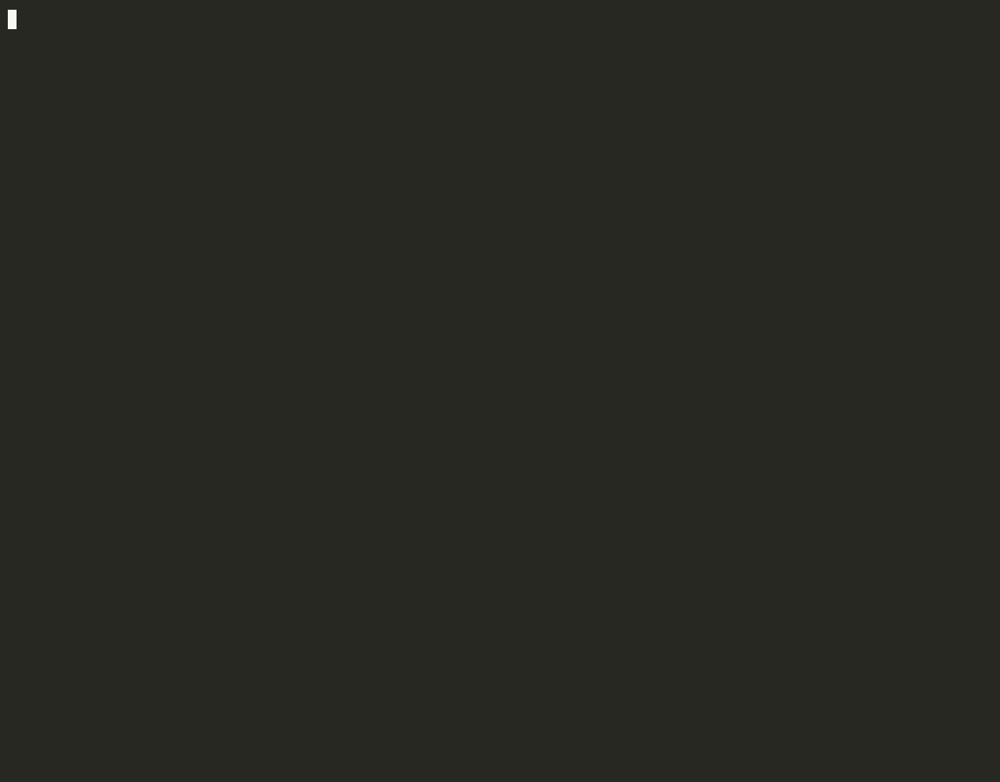
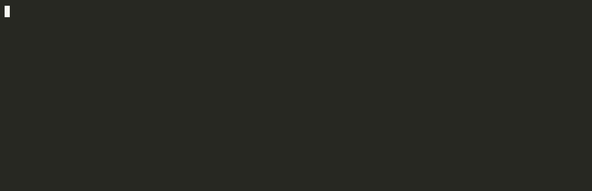

# zotero-librarian

**Your coding agent files papers into Zotero — the scripts do the judging, the agent only runs them.**

[](#works-with)
[](#works-with)
[](#works-with)
[](docs/classifier.md)
[](https://www.zotero.org)
[](#install)
[](#install)
[](https://github.com/jxxsteven7/zotero-librarian/actions/workflows/ci.yml)
[](LICENSE)

Give it a link. It fetches metadata and PDF, checks for duplicates, finds the venue and the project page, files the
paper into the right collection, tags it from a controlled vocabulary **with the sentence that justifies each tag**,
saves through your running Zotero, verifies the cloud sync, logs — and prints one table. A local model (or, without a
GPU, the agent) settles only the borderline tags. You read the paper yourself.



<!-- zotero-screenshot: the organized library (collections, [date] [venue] titles, tag pane) goes here -->

## Why

Reading papers is how understanding is built; a model's summary is someone else's reading. This tool stops before
that point: it does the part that carries no insight but eats the afternoon — finding, deduplicating, naming, filing,
tagging, keeping three machines consistent — so a paper goes from "saw the link" to "in the right place, ready to
read" in one command. Every tag comes with its evidence; the borderline ones are left to you.

## Quick start

```bash
git clone https://github.com/jxxsteven7/zotero-librarian.git ~/zotero-librarian && cd ~/zotero-librarian
cp .env.example .env        # ZOTERO_API_KEY + ZOTERO_LIBRARY_ID (zotero.org/settings/keys); data dir is auto-detected
./setup.sh                  # health check with the fix for every missing piece
claude                      # or codex / kimi — then: /download <link>
```

Needs Python 3.11+ (nothing to pip-install), `pdftotext` (poppler) or `pip install pypdf`, Zotero 7+ with sync on.
Optional: [Ollama](https://ollama.com) + `ollama pull qwen3.5:9b` for free local adjudication (else `ZC_LLM=agent`).

**Library already full and messy?** `zl.py tidy` organizes everything that has no status tag yet — on a first run,
the whole library: `--dry-run --limit 20` to see the plan, then `--create-collections` to run it. What it files by is
entirely `taxonomy.toml` (collections, tag definitions, rules, venues — edit it for your field; `title_prefix = false`
if you want your titles left alone). Step by step: [docs/first-run.md](docs/first-run.md).

## What it does

| Skill / command | |
|---|---|
| `/download` · `zl.py add <links>` | arXiv, DOI, OpenReview, PDF link or file, project page → fetched, classified, saved, verified. Pauses only when the collection is genuinely ambiguous. |
| `/tidy` · `zl.py tidy` | Papers you dropped into Zotero by hand: metadata, title, URL, short title, tags, collection. |
| `/discover` · `zl.py discover` | Last N days of arXiv / HF papers scored against *your* tags. Nothing saved. |
| `/refs` · `zl.py refs <paper>` | References and citations (Semantic Scholar) split into "have" / "missing"; `--library` maps citations among your own papers. |
| `zl.py recheck` · `tag` · `untag` · `set` | Re-verify venues and dates; single-item edits. |

<details><summary><code>zl.py discover</code> — what appeared on arXiv this week that matches my tags</summary>


</details>
<details><summary><code>zl.py refs</code> — what a paper builds on and who builds on it, split by what the library already has</summary>


</details>

Conventions: titles `[YYYY-MMDD] [Venue] Title` (v1 date, venue abbreviation, `[arXiv]` until accepted); URL field =
project page; tags `family:value` from `taxonomy.toml`, one reading status per item; PDFs saved by Zotero itself so
they sync everywhere; every write logged locally, nothing ever deleted. The tool ends at Zotero — if you also mirror
the library to Notion with the [Notero](https://github.com/dvanoni/notero) plugin, these conventions are what make the
mirror useful (Short Title = page title, URL = project page); the recipe is in [docs/notero.md](docs/notero.md).

## Works with

| Agent | reads | invoke |
|---|---|---|
| Claude Code | `CLAUDE.md` → `AGENTS.md`, `.claude/skills/` | `/download <link>` |
| Codex CLI | `AGENTS.md`, `.agents/skills/` | `$download <link>` (allow network: `[sandbox_workspace_write] network_access = true`) |
| Kimi Code CLI | `AGENTS.md`, `.agents/skills/` | `/skill:download <link>` |

One rule file, one set of skills in the [Agent Skills](https://agentskills.io) format; `.claude/skills` is a verbatim
copy that `zl.py setup` checks. Use it from any directory with `python3 zl.py install` (launcher `zl` on PATH +
user-level skills for all three agents; `--remove` undoes it). Ubuntu, macOS and Windows (`python zl.py ...`).

## How it decides

Rules from `taxonomy.toml` extract evidence and assign what clears the thresholds; an adjudicator — Ollama, an
OpenAI-compatible server, or the agent itself (`ZC_LLM`) — settles the candidates in `embod` / `tech` / `base`; it never
overrides a rule or the collection. On the author's 129 hand-tagged papers: rules 0.89 precision / 0.75 recall,
rules + qwen3.5:9b 0.87 / 0.81, 127 / 129 collections. Edit the taxonomy for your field, measure with
`tools/eval_classify.py`. Details, all numbers and the config: [docs/classifier.md](docs/classifier.md).

## Layout

```
zl.py  taxonomy.toml  AGENTS.md          entry point · your collections, tags, rules, venues · the agent's rules (CLAUDE.md imports it)
zotero_librarian/                        fetch / classify / llm / pipeline / connector / zapi / ... (stdlib only)
.agents/skills/  .claude/skills/         download · tidy · discover · refs  (source · verbatim copy)
docs/  tools/  CHANGELOG.md              first-run.md, classifier.md, notero.md · eval_classify.py, check_commits.py, fix_pdf_names.js · one line per version
tests/  .github/workflows/ci.yml         unit tests on synthetic papers; CI runs them + `zl.py setup --offline` on Ubuntu, macOS, Windows
.env  cache/  inbox/  logs/              per machine, git-ignored
```

## Contributing

Issues and PRs welcome — taxonomies for other fields most of all. The procedure, step by step, is in
[CONTRIBUTING.md](CONTRIBUTING.md); reviews follow Google's
[standard of code review](https://google.github.io/eng-practices/review/reviewer/standard.html). CI runs
`python3 zl.py setup --offline` and `python3 -m unittest discover -s tests` on the three platforms for every PR — the same two
commands you run before pushing (neither needs a Zotero library) — and `tools/check_commits.py`, which enforces the version rule
(a commit that changes the code, the taxonomy or the skills is `vX.Y:` and bumps `__version__` + `CHANGELOG.md`).

## Status · License

Used daily by its author on one robot-learning library from three machines; Zotero 7 and 10. The connector endpoints
are the ones the official browser connector uses, not a documented API. MIT.

## Credits and references

Nothing here is bundled from another project; these are the things it talks to or follows, with their terms.

- [Zotero](https://www.zotero.org) — the [Web API](https://www.zotero.org/support/dev/web_api/v3/start) for edits and the
  desktop [connector](https://github.com/zotero/zotero-connectors) endpoints for new items and PDFs; the local database is only
  ever read from a copy. Zotero is AGPL-3.0 software; no Zotero code is included.
- [Notero](https://github.com/dvanoni/notero) by David Vanoni (MIT) — optional Notion mirror; `docs/notero.md` documents
  its configuration, this tool contains no Notero code.
- [Ollama](https://ollama.com) (MIT) and any OpenAI-compatible server — local adjudication; the default model is
  [Qwen3.5](https://huggingface.co/Qwen) (Apache-2.0), pulled by you.
- [arXiv API](https://info.arxiv.org/help/api/index.html) ([terms of use](https://info.arxiv.org/help/api/tou.html)),
  [Crossref REST API](https://api.crossref.org), [Semantic Scholar Academic Graph API](https://api.semanticscholar.org)
  ([license](https://api.semanticscholar.org/license)), [OpenReview](https://openreview.net),
  [Hugging Face daily papers](https://huggingface.co/papers) — metadata, venues, citations, discovery. Polite rates only;
  bring your own keys where they offer them (`S2_API_KEY`). Thank you, arXiv, for use of its open access interoperability.
- [Agent Skills](https://agentskills.io) (specification, Apache-2.0) — the `.agents/skills/` format read by Codex,
  Kimi Code CLI and others; [Claude Code](https://code.claude.com/docs/en/skills), [Codex](https://developers.openai.com/codex/skills)
  and [Kimi Code CLI](https://github.com/MoonshotAI/kimi-cli) documentation for where each one looks.
- [Google engineering practices](https://google.github.io/eng-practices/) — the review rule in `AGENTS.md` /
  `CONTRIBUTING.md` is adapted from *The standard of code review* (© Google, [CC BY 3.0](https://creativecommons.org/licenses/by/3.0/)).
- [ARIS](https://github.com/wanshuiyin/Auto-claude-code-research-in-sleep) (MIT) — the precedent for keeping the agent
  layer as plain Markdown skills that several CLIs can read.
- Badges by [shields.io](https://shields.io); logos from [Simple Icons](https://simpleicons.org) (CC0; the marks belong
  to their owners). Claude, Codex, Kimi, Zotero, Notion and Ollama are trademarks of their respective owners; this
  project is not affiliated with any of them.
