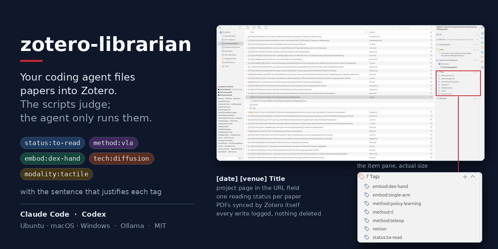
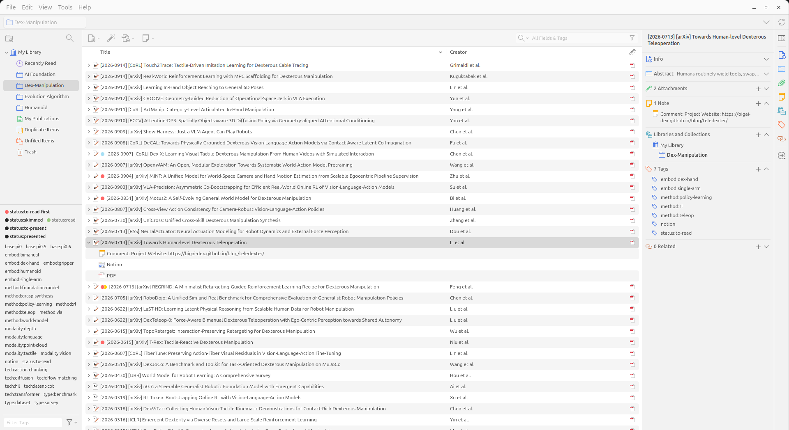

[English](README.md) · **简体中文**

[](https://code.claude.com/docs/en/setup)
[](https://developers.openai.com/codex/cli/)
[](https://ollama.com/download)<br>
[](https://www.zotero.org/download/)
[](#快速开始)
[](LICENSE)

**让你的 coding agent 把论文归进 Zotero：判断由脚本做，agent 只负责跑脚本。**

给它一条链接。它抓取元数据和 PDF，查重，查录用会议和项目主页，把论文放进正确的分类，从受控词表里打标签
**并附上支撑每个标签的那句原文**，通过你正开着的 Zotero 存入，核对云端同步，写日志，最后打印一张表。
只有拿不准的标签才交给本地模型（没有 GPU 就交给 agent）裁决。论文本身还是你自己读。

它维护的文献库长这样：四个分类，列表里每条都是 `[日期] [会议] 标题`，每个条目和标签选择器里都是 `family:value`
形式的标签，URL 字段是项目主页，每台同步的机器上都一样。



## 为什么做这个

理解是读出来的，模型的总结是别人替你读的。这个工具停在那条线之前：它只做没有洞见、却吃掉一下午的那部分——
找、查重、命名、归档、打标签、让三台机器保持一致——让一篇论文从"看到链接"到"放在正确位置、可以开读"
只需一条命令。每个标签都带证据，拿不准的留给你。

## 快速开始

```bash
git clone https://github.com/jxxsteven7/zotero-librarian.git ~/zotero-librarian && cd ~/zotero-librarian
cp .env.example .env        # 填 ZOTERO_API_KEY 和 ZOTERO_LIBRARY_ID（zotero.org/settings/keys）；数据目录自动探测
./setup.sh                  # 体检，每一项缺失都会给出修复方法
claude                      # 或 codex，然后：/download <链接>
```

需要 Python 3.11+（不用 pip 装任何东西）、`pdftotext`（poppler）或 `pip install pypdf`、开了同步的 Zotero 7+。
可选：[Ollama](https://ollama.com) + `ollama pull qwen3.5:9b`（约 6 GB），让本地模型免费裁决边缘标签；没装的话只跑规则，
并会说明这一点——在 `.env` 里设 `ZC_LLM=agent` 让 coding agent 来裁决，或 `ZC_LLM=off` 把候选留给你自己
（[它怎么判断](docs/classifier.md)）。

**文献库已经堆满、一团乱？** `zl.py tidy` 会整理所有还没有状态标签的条目——第一次跑就是整个库：先
`--dry-run --limit 20` 看计划，再加 `--create-collections` 执行。归档依据全在 `taxonomy.toml`
（分类、标签定义、规则、会议缩写——改成你领域的；不想动标题就设 `title_prefix = false`）。逐步说明：
[docs/first-run.md](docs/first-run.md)。

## 它能做什么

| Skill / 命令 | |
|---|---|
| `/download` · `zl.py add <链接>` | arXiv、DOI、OpenReview、PDF 链接或文件、项目主页 → 抓取、分类、存入、核对。只在分类确实拿不准时暂停。 |
| `/tidy` · `zl.py tidy` | 手动拖进 Zotero 的论文：补元数据、标题、URL、短标题、标签、分类。 |
| `/discover` · `zl.py discover` | 最近 N 天的 arXiv / HF 论文，按*你的*标签打分。不写入任何东西。 |
| `/refs` · `zl.py refs <论文>` | 参考文献和引用它的论文（Semantic Scholar），分成"库里有"/"库里没有"；`--library` 画库内论文之间的引用关系。 |
| `zl.py recheck` · `tag` · `untag` · `set` | 重新核对会议和日期；单条目编辑。 |

每个 skill 一段录屏，未剪辑（`docs/demo.sh` 可重录）：

`/download`——进去一条链接，出来一篇归好档的论文：卡片、带证据的标签、经 Zotero 存入、同步核对、一张表。


`/tidy`——一个手动拖进 Zotero 的 PDF（只有标题和 PDF，别的什么都没有）补齐元数据、标题、项目主页、标签、分类和阅读状态：


`/discover`——最近几天 arXiv 上出现的、匹配你标签的论文，库里已有的不列：


`/refs`——一篇论文建立在谁之上、又被谁引用，分成库里有的和库里缺的：


约定：标题 `[YYYY-MMDD] [Venue] Title`（v1 日期，会议缩写，未查到录用信息前是 `[arXiv]`）；URL 字段 = 项目主页；
标签是 `taxonomy.toml` 里的 `family:value`，每条一个阅读状态；PDF 由 Zotero 自己保存，所以处处同步；每次写入本地都有日志，
从不删除任何东西。工具到 Zotero 为止——如果你还用 [Notero](https://github.com/dvanoni/notero) 插件把库镜像到 Notion，
正是这些约定让镜像好用（短标题 = 页面标题，URL = 项目主页）；配方在 [docs/notero.md](docs/notero.md)。

## 支持的 agent

| Agent | 读取 | 调用 |
|---|---|---|
| Claude Code | `CLAUDE.md` → `AGENTS.md`，`.claude/skills/` | `/download <链接>` |
| Codex CLI | `AGENTS.md`，`.agents/skills/` | `$download <链接>`（要放开网络：`[sandbox_workspace_write] network_access = true`；Ubuntu 24.04+ 还要 `sudo sysctl -w kernel.apparmor_restrict_unprivileged_userns=0`，否则它的沙箱起不来） |

一份规则文件，一套 [Agent Skills](https://agentskills.io) 格式的 skills；`.claude/skills` 是逐字副本，`zl.py setup` 会核对。
想在任意目录使用：`python3 zl.py install`（把启动器 `zl` 放到 PATH，并给两个 agent 装用户级 skills；`--remove` 撤销）。
支持 Ubuntu、macOS、Windows（Windows 上写 `python zl.py ...`）。

## 它怎么判断

`taxonomy.toml` 里的规则提取证据，过了阈值的直接写入；裁决者——Ollama、任意 OpenAI 兼容服务、或 agent 自己（`ZC_LLM`）——
只裁决 `embod` / `tech` / `base` 里的候选，从不推翻规则或分类。在作者手工标注的 138 篇论文上：规则精确率 0.90 / 召回 0.77，
规则 + qwen3.5:9b 0.88 / 0.83，分类 136 / 138。把 taxonomy 改成你的领域，用 `tools/eval_classify.py` 量一量。
细节、全部数字和配置：[docs/classifier.md](docs/classifier.md)；文件里每个键及其驱动的打分：[docs/taxonomy.md](docs/taxonomy.md)。

随仓库发布的 `taxonomy.toml` 是机器人学习——维护者自己的方向，刻意保持小而精，并在真实文献库上量过。
代码本身对机器人一无所知：换一个领域就是同一个文件换一套分类、取值和会议。请以 PR 形式提交你的
（`taxonomies/<领域>.toml`，附上你的 eval 数字），而不是把这份撑大。

## 目录结构

```
zl.py  taxonomy.toml  AGENTS.md          入口 · 你的分类、标签、规则、会议缩写 · agent 的规则（CLAUDE.md 引用它）
zotero_librarian/                        fetch / classify / llm / pipeline / connector / zapi / ...（只用标准库）
.agents/skills/  .claude/skills/         download · tidy · discover · refs（源文件 · 逐字副本）
docs/  tools/  CHANGELOG.md              first-run.md、classifier.md、taxonomy.md、notero.md · eval_classify.py、check_commits.py、fix_pdf_names.js、banner.py · 每个版本一行
tests/  .github/workflows/ci.yml         合成论文上的单元测试；CI 在 Ubuntu、macOS、Windows 上跑测试 + `zl.py setup --offline`
.env  cache/  inbox/  logs/              每台机器各自的，git 忽略
```

## 参与贡献

欢迎 issue 和 PR——最欢迎其他领域的 taxonomy。完整步骤在 [CONTRIBUTING.md](CONTRIBUTING.md)；review 遵循 Google 的
[代码审查标准](https://google.github.io/eng-practices/review/reviewer/standard.html)。每个 PR 的 CI 都在三个平台上跑
`python3 zl.py setup --offline` 和 `python3 -m unittest discover -s tests`——和你推送前跑的是同两条命令（都不需要 Zotero 库）——
以及 `tools/check_commits.py`，它强制执行版本规则（改了代码、taxonomy 或 skills 的提交标题是 `vX.Y:`，并同步 `__version__`
和 `CHANGELOG.md`）。

## 状态 · 许可证

作者每天在一个机器人学习文献库上使用，三台机器；Zotero 7 和 10。connector 端点是官方浏览器插件用的那套，不是公开文档化的 API。MIT。

## 致谢与引用

这里没有捆绑任何其他项目的代码；下面是它对话或遵循的东西，以及各自的条款。

- [Zotero](https://www.zotero.org)——编辑走 [Web API](https://www.zotero.org/support/dev/web_api/v3/start)，新条目和 PDF 走桌面端
  [connector](https://github.com/zotero/zotero-connectors) 端点；本地数据库只从副本读取。Zotero 是 AGPL-3.0 软件；未包含任何 Zotero 代码。
- [Notero](https://github.com/dvanoni/notero)，David Vanoni（MIT）——可选的 Notion 镜像；`docs/notero.md` 记录其配置，本工具不含 Notero 代码。
- [Ollama](https://ollama.com)（MIT）及任意 OpenAI 兼容服务——本地裁决；默认模型是 [Qwen3.5](https://huggingface.co/Qwen)（Apache-2.0），由你自己拉取。
- [arXiv API](https://info.arxiv.org/help/api/index.html)（[使用条款](https://info.arxiv.org/help/api/tou.html)）、
  [Crossref REST API](https://api.crossref.org)、[Semantic Scholar Academic Graph API](https://api.semanticscholar.org)
  （[许可](https://api.semanticscholar.org/license)）、[OpenReview](https://openreview.net)、
  [Hugging Face daily papers](https://huggingface.co/papers)——元数据、会议、引用、发现。只以礼貌的频率访问；提供密钥的地方请用你自己的
  （`S2_API_KEY`）。感谢 arXiv 提供开放获取的互操作接口。
- [Agent Skills](https://agentskills.io)（规范，Apache-2.0）——Codex 等读取的 `.agents/skills/` 格式；
  各家在哪里找 skills 见 [Claude Code](https://code.claude.com/docs/en/skills) 和 [Codex](https://developers.openai.com/codex/skills) 的文档。
- [Google 工程实践](https://google.github.io/eng-practices/)——`AGENTS.md` / `CONTRIBUTING.md` 里的 review 规则改编自
  *The standard of code review*（© Google，[CC BY 3.0](https://creativecommons.org/licenses/by/3.0/)）。
- [ARIS](https://github.com/wanshuiyin/Auto-claude-code-research-in-sleep)（MIT）——把 agent 层写成多个 CLI 都能读的纯 Markdown skills，这是先例。
- 徽章来自 [shields.io](https://shields.io)；图标来自 [Simple Icons](https://simpleicons.org)（CC0；商标归各自所有者）。Claude、Codex、
  Zotero、Notion 和 Ollama 是各自所有者的商标；本项目与它们均无关联。
